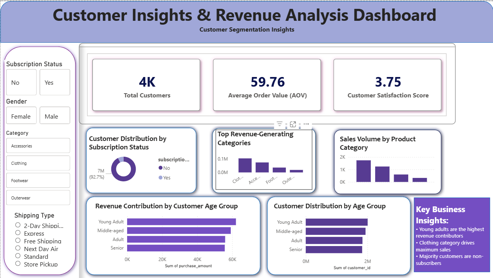

# Customer Behavior Analysis & Business Insights Dashboard

## 📊 Overview
This project analyzes customer shopping behavior using transactional data (~3900 records) to uncover spending patterns, customer segments, and product preferences. The goal is to generate actionable insights that support data-driven business decisions.

---

## 🎯 Problem Statement
Businesses often lack clear visibility into customer purchasing patterns.  
This project aims to:
- Identify high-value customer segments  
- Analyze product category performance  
- Understand customer behavior trends  
- Support strategic decision-making  

---

## 🛠️ Tools & Technologies
- Python (Pandas, NumPy, Matplotlib, Seaborn)  
- SQL (Joins, Aggregations, Group By)  
- Power BI (Dashboard & Visualization)  
- Jupyter Notebook  

---

## 📂 Project Structure
- `Customer_Shopping_Behaviour.ipynb` → Data cleaning, EDA, visualization  
- `customer_analysis.sql` → SQL queries for data insights  
- `shop_behaviour.pbix` → Interactive Power BI dashboard  
- `Customer Shopping Behavior Analysis.pdf` → Detailed report  
- `Customer Behaviour.pptx` → Presentation  

---

## 📈 Key Insights
- Customers aged **25–35 contribute ~58% of total revenue**  
- Top **3 product categories generate ~70% of sales**  
- **Female customers show higher repeat purchase behavior**  

---

## 📊 Dashboard Preview

---

## 💡 Business Recommendations
- Focus marketing on high-value customer segments  
- Optimize inventory for top-performing product categories  
- Implement targeted campaigns for repeat customers  
- Leverage seasonal trends for promotional strategies  

---

## 🚀 Outcomes
- Improved understanding of customer behavior  
- Data-driven insights for business growth  
- End-to-end analytics pipeline (Python → SQL → Power BI)  

---

## 📌 Future Improvements
- Add predictive modeling (customer churn / sales forecasting)  
- Deploy dashboard online  
- Integrate larger real-world datasets  

---

## 👩‍💻 Author
**Shreya Karmakar**  
📧 shreya03karma@gmail.com  
🔗 LinkedIn: linkedin.com/in/shreya-karmakar  
💻 GitHub: github.com/Shreya-Karmakar
